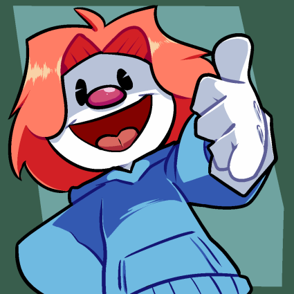

<html lang="es">
<head>
    <meta charset="UTF-8">
    <meta name="viewport" content="width=device-width, initial-scale=1.0">
    <link rel="icon" href="img/clow.png">
    <title>Clowny</title>
    

</head>
<body>
    <h2 class="glitch">La descripción de Clowny</h2>
    
Clowny, el personaje de esta intrigante historia, encarna una fusión única entre la alegría y la ferocidad. Con su característica personalidad, este peculiar payaso mitad tiburón irradia un encanto inigualable que cautiva a todos a su paso. Su presencia en el circo es sinónimo de diversión desenfrenada y emociones al límite.

        Conocido por su ingenio desbordante y su espíritu innovador, Clowny es más que un simple entretenedor. Es un "codeador insano", un genio detrás de la pantalla que desafía los límites de la tecnología para crear mundos virtuales donde la imaginación cobra vida. Su destreza en la programación es tan sorprendente como sus acrobacias en el escenario, dejando a todos maravillados con sus creaciones digitales.
        
        Pero detrás de esa fachada extravagante y colorida, Clowny es también un "papeador suprumero", un ser profundo y reflexivo que encuentra belleza en las cosas más simples de la vida. Su capacidad para entrelazar lo lúdico con lo serio lo convierte en una figura enigmática y fascinante para aquellos que tienen el privilegio de conocerlo más de cerca.
        
        Y aunque su apariencia y su comportamiento puedan desafiar las convenciones sociales, Clowny es, sin lugar a dudas, el "gay favorito" del circo. Su autenticidad y su aceptación incondicional de sí mismo inspiran a otros a abrazar su verdadera identidad con valentía y orgullo. En un mundo donde la diversidad a menudo es malinterpretada, Clowny brilla como un faro de esperanza y aceptación.
        
        Y por último, pero no menos importante, está su relación con Yologod, su "novio de yologod osi osi". Juntos, forman un vínculo inquebrantable basado en el amor, el respeto y la complicidad. Su conexión trasciende las barreras del tiempo y el espacio, creando un lazo indisoluble que desafía todas las probabilidades. En el tumultuoso mundo del circo, su relación es un faro de estabilidad y apoyo mutuo.
        
        En resumen, Clowny es mucho más que un simple payaso. Es una amalgama de contrastes, una mezcla intrigante de humor y profundidad, de excentricidad y autenticidad. Su historia es una oda a la diversidad y a la belleza de ser uno mismo en un mundo que a menudo prefiere la uniformidad.

    
</body>
</html>

